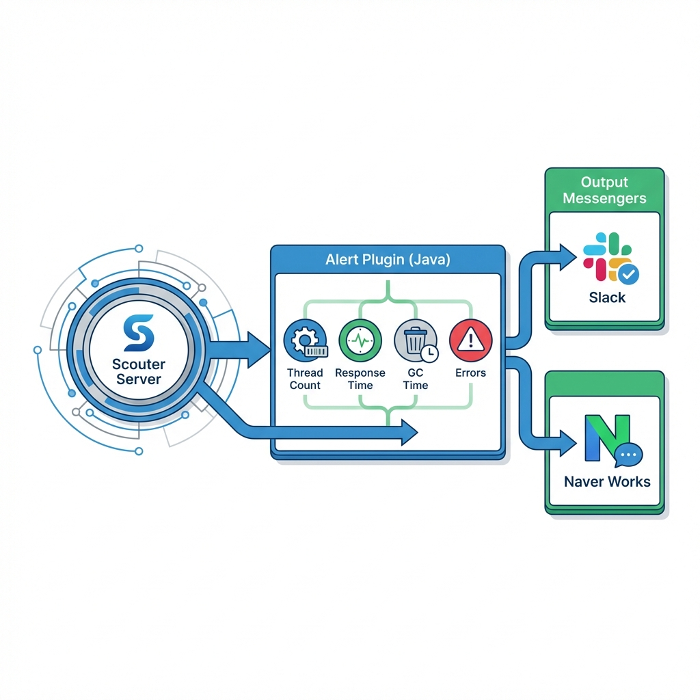
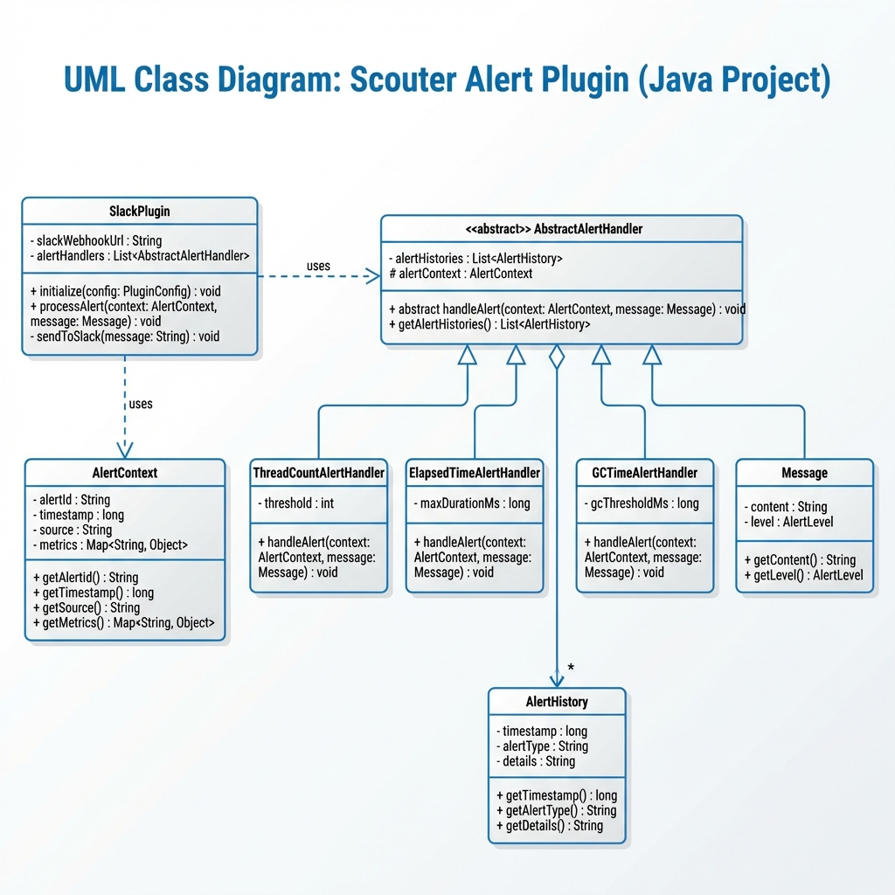
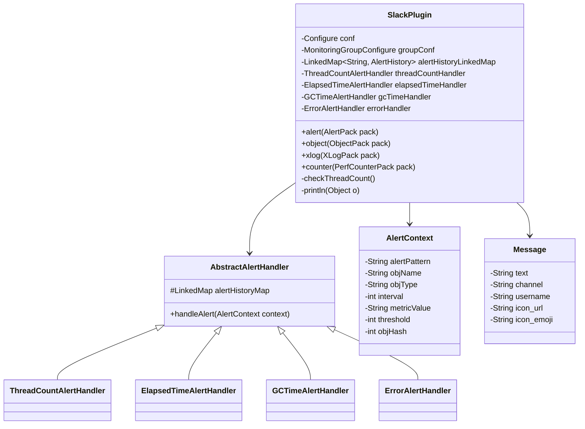
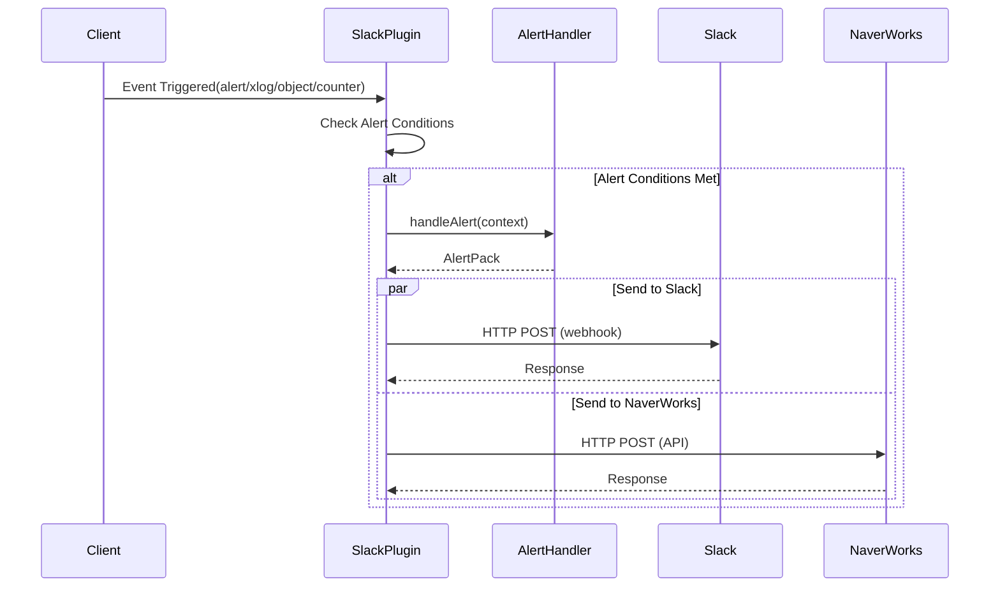
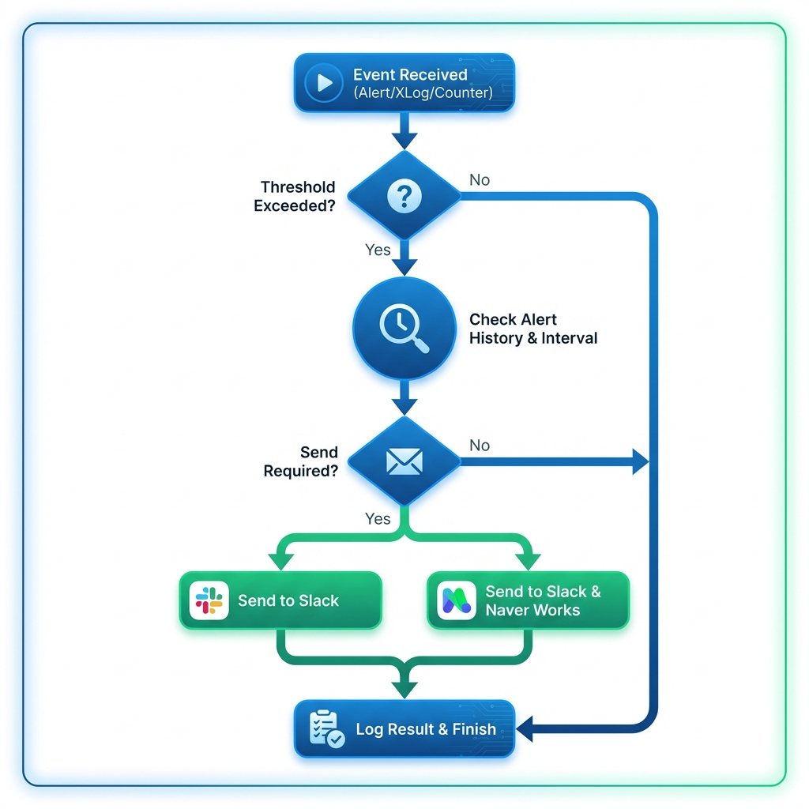
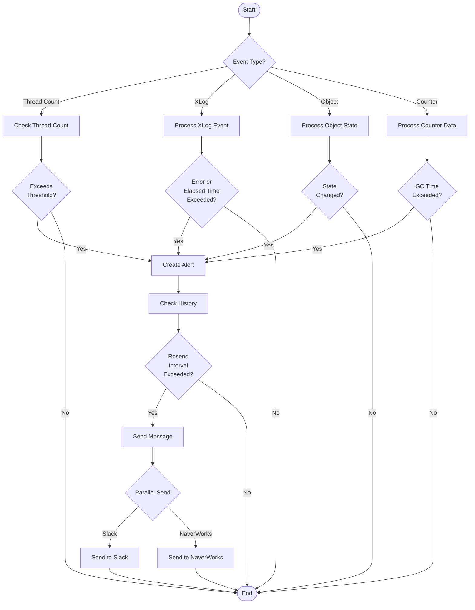

# Scouter Plugin Server Alert Slack

## Introduction
This plugin provides functionality to send Scouter server alerts to Slack channels.

## Key Features
- Support for various alert types (Thread Count, Response Time, Error, GC Time)
- Differentiated handling by alert levels (FATAL, WARN, INFO)
- Alert history management
- Slack channel configuration support per monitoring group

## System Diagrams



### Class Diagram




### Sequence Diagram


### Activity Diagram




## System Architecture

### Core Components

#### AbstractAlertHandler
- Abstract base class for alert handling
- Implements common alert logic
- Defines alert handling patterns for subclasses

#### AlertContext
- Encapsulates alert-related data
- Contains all context information needed for alert processing

### Alert Handlers

#### ThreadCountAlertHandler
- Handles thread count related alerts
- Threshold: Uses FATAL level when historyCount > 1
- Monitors thread count increase trends

#### ElapsedTimeAlertHandler
- Handles response time related alerts
- Level determination logic:
  - Determines FATAL/WARN/INFO level based on historyAvg
  - Skips INFO level alerts
- Monitors performance degradation situations

#### ErrorAlertHandler
- Handles error related alerts
- Always uses ERROR level
- Uses error message as alert title
- Includes detailed error information

#### GCTimeAlertHandler
- Handles GC time related alerts
- Threshold: Uses FATAL level when historyCount > 0
- Includes interval logging
- Monitors GC performance issues

## Configuration

### Basic Setup
```properties
# Slack webhook URL configuration
ext_plugin_slack_webhook_url=https://hooks.slack.com/services/...

# Alert channel configuration
ext_plugin_slack_channel=#monitoring

# Alert username configuration
ext_plugin_slack_botName=Scouter
```

### Monitoring Group Configuration
```properties
# Channel configuration per monitoring group
ext_plugin_slack_channel_group_a=#group-a-monitoring
ext_plugin_slack_channel_group_b=#group-b-monitoring
```

## Alert Level Characteristics

### FATAL
- Critical issues requiring immediate action
- Immediate alert dispatch
- Includes detailed information

### WARN
- Situations requiring attention
- Warns of potential issues
- Includes basic information

### INFO
- Reference information
- Alerts sent only when necessary
- Includes simple information

## History Management
- Maintains history for each alert type
- Used for problem pattern analysis
- Supports alert deduplication

## Usage Examples

### Thread Count Alert
```
[FATAL] Thread Count Alert
- Instance: OrderService
- Current Count: 100
- Threshold: 80
- History Count: 3
```

### Response Time Alert
```
[WARN] Elapsed Time Alert
- Instance: PaymentService
- Current Time: 5000ms
- Average Time: 4500ms
- Threshold: 3000ms
```

### Error Alert
```
[ERROR] Exception Alert
- Instance: UserService
- Error: NullPointerException
- Location: UserController.java:150
- Stack Trace: ...
```

### GC Time Alert
```
[FATAL] GC Time Alert
- Instance: AuthService
- Current Time: 500ms
- Interval: 60s
- History Count: 2
```

## Important Notes
1. Keep Slack webhook URL secure and prevent external exposure
2. Consider service characteristics when setting alert thresholds
3. Verify channel names when configuring alert channels
