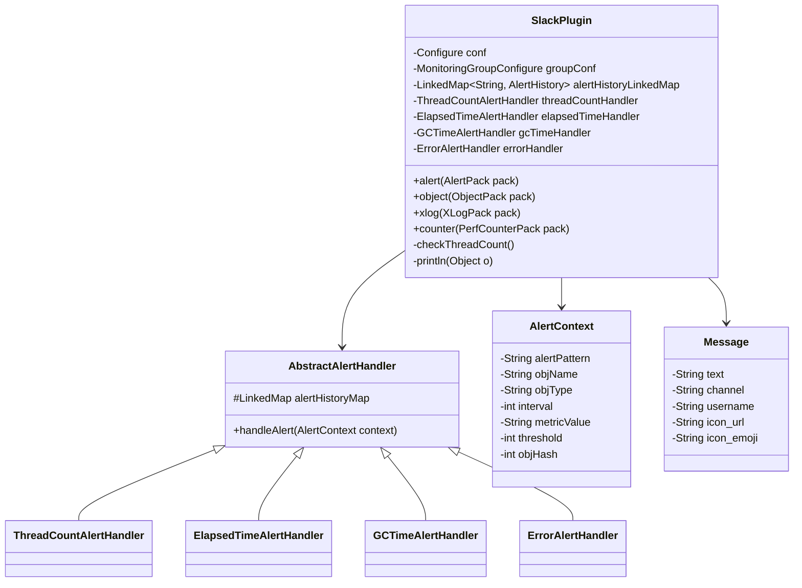
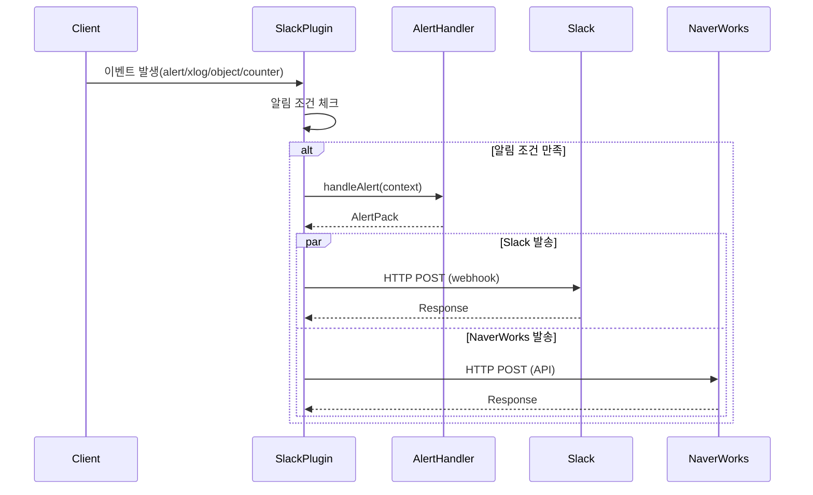
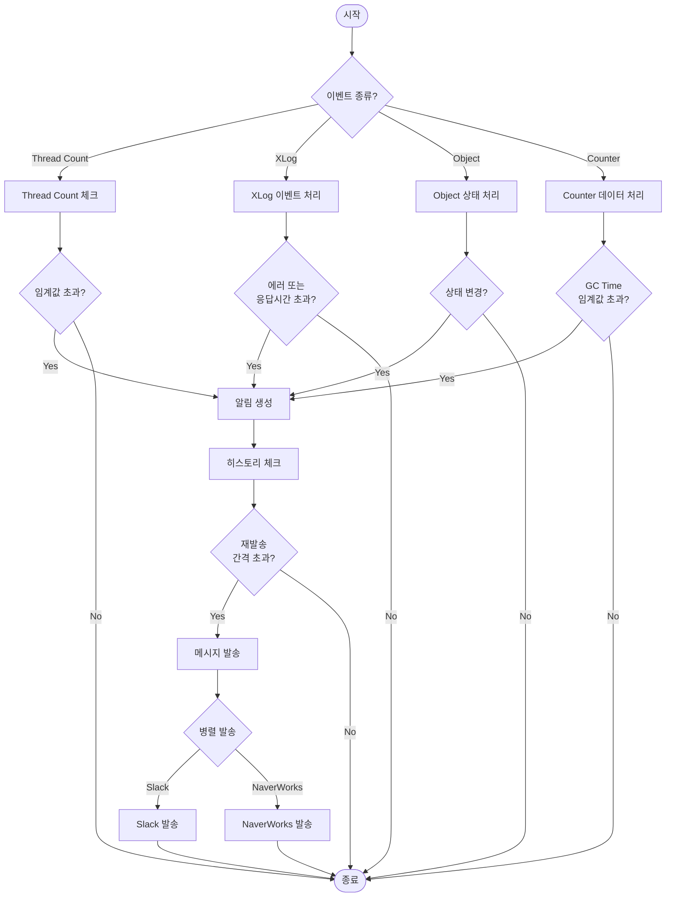

# Scouter Plugin Server Alert Messenger

## 소개
이 플러그인은 Scouter 서버의 알림을 다양한 메신저로 전송하는 기능을 제공합니다.

## 지원하는 메신저
- Slack
- Naver Works

## 주요 기능
- 다양한 유형의 알림 지원 (스레드 수, 응답시간, 에러, GC 시간)
- 알림 레벨별 차별화된 처리 (FATAL, WARN, INFO)
- 알림 히스토리 관리
- Slack 채널별 알림 설정 지원

## 시스템 다이어그램


### 클래스 다이어그램




### 시퀀스 다이어그램


### 액티비티 다이어그램




## 시스템 구조

### 핵심 컴포넌트

#### AbstractAlertHandler
- 알림 처리를 위한 추상 기본 클래스
- 공통 알림 로직 구현
- 하위 클래스에서 구체적인 알림 처리 방식 정의

#### AlertContext
- 알림 관련 데이터를 캡슐화하는 클래스
- 알림 처리에 필요한 모든 컨텍스트 정보 포함

### 알림 핸들러

#### ThreadCountAlertHandler
- 스레드 수 관련 알림 처리
- 임계값: historyCount > 1일 때 FATAL 레벨 사용
- 스레드 수 증가 추이 모니터링

#### ElapsedTimeAlertHandler
- 응답시간 관련 알림 처리
- 레벨 결정 로직:
  - historyAvg에 따라 FATAL/WARN/INFO 레벨 결정
  - INFO 레벨은 알림 스킵
- 성능 저하 상황 모니터링

#### ErrorAlertHandler
- 에러 관련 알림 처리
- 항상 ERROR 레벨 사용
- 에러 메시지를 알림 제목으로 사용
- 상세한 에러 정보 포함

#### GCTimeAlertHandler
- GC 시간 관련 알림 처리
- 임계값: historyCount > 0일 때 FATAL 레벨 사용
- interval 정보 로깅
- GC 성능 문제 모니터링

## 설정 방법

### Slack 설정
```properties
# Slack 알림 활성화
ext_plugin_slack_send_alert=true

# Slack 웹훅 URL 설정
ext_plugin_slack_webhook_url=https://hooks.slack.com/services/...

# 알림 채널 설정
ext_plugin_slack_channel=#monitoring

# 알림 사용자명 설정
ext_plugin_slack_botName=Scouter
```

### Naver Works 설정
```properties
# Works 알림 활성화
ext_plugin_works_send_alert=true

# Works 앱 설정
ext_plugin_works_client_id=your-client-id
ext_plugin_works_client_secret=your-client-secret

# Works 서비스 계정 설정
ext_plugin_works_service_account=your-service-account@your-domain
ext_plugin_works_private_key=your-private-key

# Bot 설정
ext_plugin_works_bot_id=your-bot-id
ext_plugin_works_channel_id=your-channel-id

# 알림 레벨 설정 (0: INFO, 1: WARN, 2: ERROR, 3: FATAL)
ext_plugin_works_level=0

# 디버그 모드 활성화
ext_plugin_works_debug=false

# API 엔드포인트 커스터마이징 (선택사항)
# ext_plugin_works_api_endpoint=https://your-custom-endpoint
```

## 채널 설정 방법

### 채널 ID 우선순위
채널 ID는 다음 우선순위로 적용됩니다:
1. 개별 서비스명 기반 채널 ID (`ext_plugin_works_channel_id.{serviceName}`)
2. 호스트명 기반 채널 ID (`ext_plugin_works_channel_id.{hostName}`)
3. 기본 채널 ID (`ext_plugin_works_channel_id`)

예시:
```properties
# 기본 채널 ID
ext_plugin_works_channel_id=default-channel-id

# 호스트별 채널 ID
ext_plugin_works_channel_id.tomcat1=tomcat1-channel-id
ext_plugin_works_channel_id.tomcat2=tomcat2-channel-id

# 서비스별 채널 ID
ext_plugin_works_channel_id.order=order-service-channel-id
ext_plugin_works_channel_id.payment=payment-service-channel-id
```

### 호스트명 추출
- `/host/serviceName` 형식: host 부분이 호스트명으로 사용됨
- `/host` 형식: host 전체가 호스트명으로 사용됨

예시:
- `/tomcat1/order` → hostName: "tomcat1"
- `/tomcat2` → hostName: "tomcat2"

## Works Bot 설정 방법

1. Works 개발자 콘솔에서 앱 등록
   - [Works 개발자 콘솔](https://developers.worksmobile.com/kr/docs/auth) 접속
   - 새 앱 등록
   - Client ID와 Client Secret 발급

2. 서비스 계정 생성
   - Works 관리자 콘솔에서 서비스 계정 생성
   - 서비스 계정 이메일 주소 확인
   - Private Key 생성 및 저장

3. Bot 생성 및 설정
   - Works 개발자 콘솔에서 Bot 생성
   - Bot ID 확인
   - Bot의 권한 설정 (메시지 발송 권한 필요)

4. Bot을 채널에 초대
   - Works 메신저에서 알림을 받을 채널 생성
   - Bot을 채널에 초대
   - 채널 ID 확인

5. Scouter 서버 설정
   - scouter.conf 파일에 위 설정 추가
   - Client ID, Client Secret 입력
   - 서비스 계정 정보 입력
   - Bot ID, Channel ID 입력
   - 서버 재시작

## 주의사항
1. Client Secret과 Private Key는 보안을 위해 외부에 노출되지 않도록 주의
2. 서비스 계정의 권한이 적절히 설정되어 있는지 확인
3. Bot이 채널에 초대되어 있고 메시지 발송 권한이 있는지 확인
4. 알림 레벨 설정으로 불필요한 알림 필터링 가능
5. 디버그 모드는 문제 해결 시에만 활성화 권장

## 알림 레벨별 특징

### FATAL
- 긴급한 조치가 필요한 심각한 문제
- 즉시 알림 발송
- 상세 정보 포함

### WARN
- 주의가 필요한 상황
- 문제 발생 가능성 경고
- 기본 정보 포함

### INFO
- 참고용 정보
- 필요한 경우에만 알림 발송
- 간단한 정보 포함

## 히스토리 관리
- 각 알림 유형별 히스토리 보관
- 문제 패턴 분석에 활용
- 알림 중복 방지 지원

## 사용 예시

### 스레드 수 알림
```
[FATAL] Thread Count Alert
- Instance: OrderService
- Current Count: 100
- Threshold: 80
- History Count: 3
```

### 응답시간 알림
```
[WARN] Elapsed Time Alert
- Instance: PaymentService
- Current Time: 5000ms
- Average Time: 4500ms
- Threshold: 3000ms
```

### 에러 알림
```
[ERROR] Exception Alert
- Instance: UserService
- Error: NullPointerException
- Location: UserController.java:150
- Stack Trace: ...
```

### GC 시간 알림
```
[FATAL] GC Time Alert
- Instance: AuthService
- Current Time: 500ms
- Interval: 60s
- History Count: 2
```
